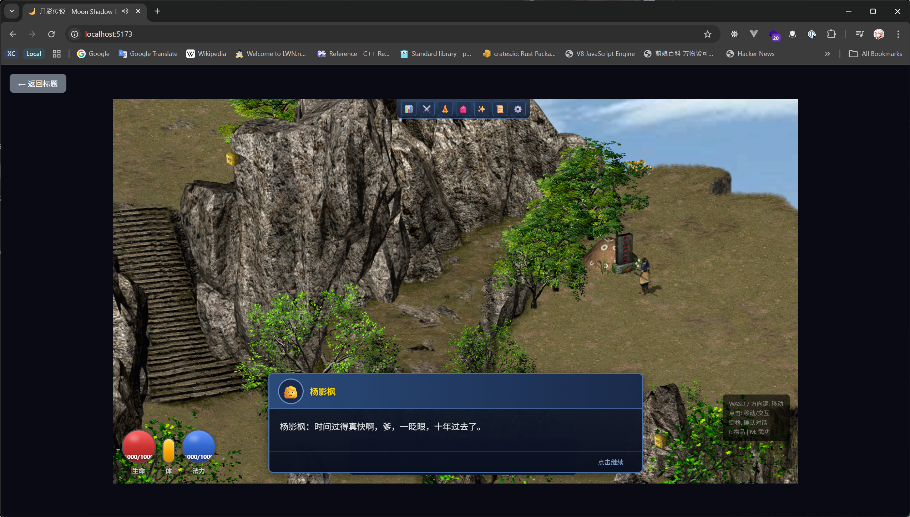
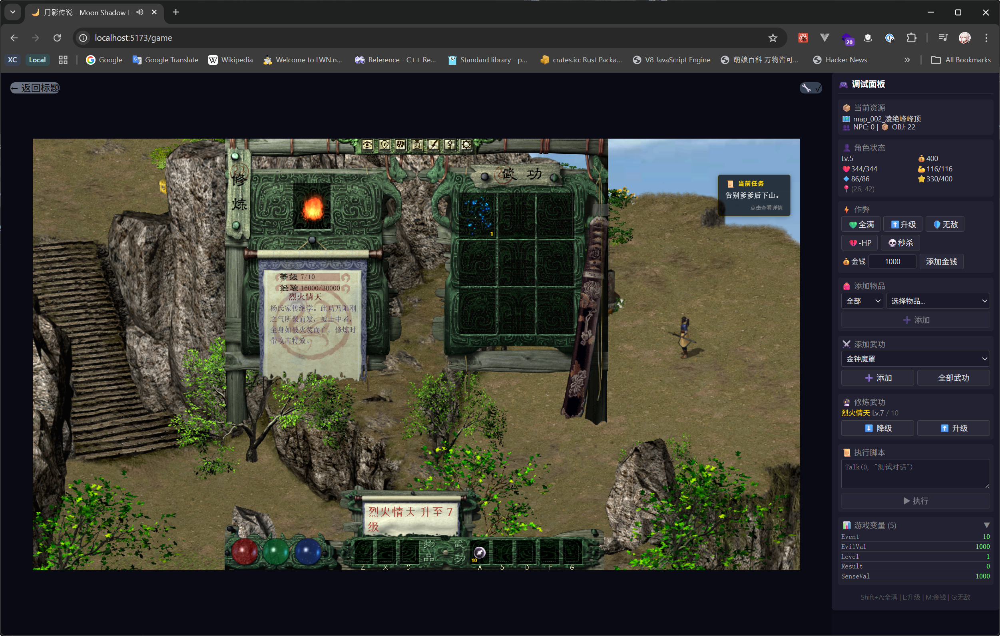

# 剑侠情缘外传：月影传说

## 📖 关于本项目

这是**西山居 2001 年**推出的经典单机 RPG《剑侠情缘外传：月影传说》的 Web 版本复刻。

原始游戏使用 C++ 开发，后来有玩家用 C# + XNA 框架进行了复刻（[JxqyHD](https://github.com/mapic91/JxqyHD)），本项目在此基础上使用 **TypeScript + React + Canvas** 技术将游戏移植到 Web 平台，让经典游戏能在浏览器中运行。





## 🎮 游戏简介

《剑侠情缘外传：月影传说》是西山居在剑侠情缘系列基础上推出的外传作品，讲述了独孤剑的成长故事。游戏特色：

- 🗺️ **武侠世界探索** - 凌绝峰、武当山、惠安镇等经典场景
- ⚔️ **即时战斗系统** - 剑法、内功、轻功的组合运用
- 🧙 **武学技能** - 丰富的武功招式和内功心法
- 💬 **剧情任务** - 跟随主角独孤剑展开武侠冒险
- 🎒 **装备系统** - 收集装备和道具提升战力
- 🎵 **原版音乐** - 保留经典配乐和音效

---

## ✨ 实现进度

### 总体完成度：约 75%

| 系统 | 进度 | 状态 |
|------|------|------|
| 地图渲染 | 80% | 🟢 可用 |
| 角色系统 | 70% | 🟢 可用 |
| 精灵动画 | 75% | 🟢 可用 |
| 剧本系统 | 90% | 🟢 可用 |
| 界面系统 | 75% | 🟢 可用 |
| 输入系统 | 90% | 🟢 可用 |
| 音效系统 | 75% | 🟢 可用 |
| 特效系统 | 50% | 🟡 部分 |
| 物品系统 | 70% | 🟢 可用 |
| 物体系统 | 50% | 🟡 部分 |
| 武功系统 | 70% | 🟢 可用 |
| 战斗系统 | 30% | 🟡 部分 |
| 高级寻路 | 0% | 🔴 未开始 |

**图例**: 🟢 可用 | 🟡 部分/进行中 | 🔴 未开始

---

## 🏗️ 架构设计

### 核心架构

本项目采用**分层架构**，严格遵循 C# 版本的设计：

```
┌─────────────────────────────────────────────────────────────┐
│                    React UI Layer                           │
│  (Game.tsx, GameUI.tsx, GameScreen.tsx, 对话框, HUD等)       │
└─────────────────────────────┬───────────────────────────────┘
                              │ 事件订阅 / API 调用
                              ▼
┌─────────────────────────────────────────────────────────────┐
│                 GameEngine (单例 - 唯一入口)                  │
│                                                             │
│  ┌─────────────────────────────────────────────────────┐   │
│  │  GlobalResourceManager (全局资源 - 只加载一次)         │   │
│  │  ├── TalkTextList    对话文本数据                     │   │
│  │  ├── LevelManager    等级配置                         │   │
│  │  ├── MagicExpConfig  武功经验配置                     │   │
│  │  └── PartnerList     伙伴名单                         │   │
│  └─────────────────────────────────────────────────────┘   │
│                                                             │
│  ┌─────────────────────────────────────────────────────┐   │
│  │  核心子系统 (由 GameEngine 创建和持有)                  │   │
│  │  ├── AudioManager      音效管理                       │   │
│  │  ├── ScreenEffects     屏幕特效                       │   │
│  │  ├── ObjManager        物体管理                       │   │
│  │  ├── CheatManager      作弊系统                       │   │
│  │  ├── MemoListManager   任务记录                       │   │
│  │  ├── TrapManager       地图陷阱                       │   │
│  │  ├── MapRenderer       地图渲染                       │   │
│  │  └── ObjRenderer       物体渲染                       │   │
│  └─────────────────────────────────────────────────────┘   │
│                                                             │
│  ┌─────────────────────────────────────────────────────┐   │
│  │  GameManager (游戏逻辑控制器)                          │   │
│  │  ├── Player            玩家角色                       │   │
│  │  ├── NpcManager        NPC 管理                       │   │
│  │  ├── GuiManager        界面管理                       │   │
│  │  ├── ScriptExecutor    剧本执行                       │   │
│  │  ├── GoodsListManager  物品列表                       │   │
│  │  ├── MagicListManager  武功列表                       │   │
│  │  ├── MagicManager      武功逻辑                       │   │
│  │  └── CollisionChecker  碰撞检测                       │   │
│  └─────────────────────────────────────────────────────┘   │
│                                                             │
│  EventEmitter (事件系统 - 引擎与UI通信)                      │
└─────────────────────────────────────────────────────────────┘
```

### 初始化流程

参照 C# 的 `JxqyGame.cs` 和 `Loader.cs`，分为三个阶段：

```typescript
// 1. 引擎初始化 (只执行一次)
await engine.initialize();
// - 加载全局资源 (TalkTextList, LevelManager, MagicExp等)
// - 创建渲染器和游戏管理器

// 2. 新游戏
await engine.newGame();
// - 运行 NewGame.txt 脚本
// - 脚本调用 LoadGame(0) 加载初始存档

// 3. 读取存档
await engine.loadGame(saveIndex);
// - 清理当前状态
// - 从存档目录加载数据
```

### 设计原则

- **单一入口**：所有子系统访问都通过 `GameEngine`，不使用全局单例函数
- **依赖注入**：子系统通过构造函数或 setter 接收依赖
- **事件驱动**：引擎通过 `EventEmitter` 通知 UI 层状态变化
- **分离关注**：引擎逻辑与 React 渲染完全分离

---

## 📁 项目结构

```
game-jxqy/
├── src/
│   ├── engine/                  # 游戏引擎（核心）
│   │   ├── game/
│   │   │   ├── gameEngine.ts    # 引擎单例（入口）
│   │   │   ├── gameManager.ts   # 游戏逻辑控制器
│   │   │   └── scriptContextFactory.ts
│   │   │
│   │   ├── resource/
│   │   │   └── globalResourceManager.ts  # 全局资源管理
│   │   │
│   │   ├── character/           # 角色系统
│   │   │   ├── player.ts        # 玩家
│   │   │   ├── npc.ts           # NPC
│   │   │   └── npcManager.ts    # NPC 管理
│   │   │
│   │   ├── script/              # 剧本系统
│   │   │   ├── parser.ts        # 解析器
│   │   │   └── executor.ts      # 执行器
│   │   │
│   │   ├── magic/               # 武功系统
│   │   │   ├── magicManager.ts  # 武功逻辑
│   │   │   ├── magicListManager.ts
│   │   │   └── magicRenderer.ts
│   │   │
│   │   ├── goods/               # 物品系统
│   │   │   ├── good.ts
│   │   │   └── goodsListManager.ts
│   │   │
│   │   ├── gui/                 # 界面系统
│   │   │   └── guiManager.ts
│   │   │
│   │   ├── audio/               # 音效系统
│   │   │   └── audioManager.ts
│   │   │
│   │   ├── effects/             # 特效系统
│   │   │   └── screenEffects.ts
│   │   │
│   │   ├── obj/                 # 物体系统
│   │   │   └── objManager.ts
│   │   │
│   │   ├── level/               # 等级系统
│   │   │   └── levelManager.ts
│   │   │
│   │   ├── cheat/               # 作弊系统
│   │   │   └── cheatManager.ts
│   │   │
│   │   └── core/                # 核心工具
│   │       ├── types.ts         # 类型定义
│   │       ├── eventEmitter.ts  # 事件系统
│   │       └── utils.ts         # 工具函数
│   │
│   ├── components/              # React 组件
│   │   ├── game/
│   │   │   ├── Game.tsx         # 游戏主组件
│   │   │   └── GameUI.tsx       # 游戏UI
│   │   └── ui/                  # UI 组件
│   │
│   ├── pages/
│   │   └── GameScreen.tsx       # 游戏页面
│   │
│   ├── hooks/
│   │   └── useGameEngine.ts     # 引擎 Hook
│   │
│   └── App.tsx                  # 应用入口
│
├── resources/                   # 游戏资源
│   ├── map/                     # 地图文件 (.map)
│   ├── asf/                     # 精灵动画 (.asf)
│   ├── mpc/                     # 资源包 (.mpc)
│   ├── ini/                     # 配置文件 (.ini)
│   ├── script/                  # 游戏剧本 (.txt)
│   └── save/                    # 存档目录
│
└── JxqyHD/                      # C# 参考代码
    └── Engine/
```

---

## 🚀 快速开始

### 环境要求

- **Node.js** 18+
- **pnpm**（推荐）或 npm/yarn
- 支持 Canvas API 的现代浏览器

### 安装运行

```bash
# 克隆仓库
git clone https://github.com/patchoulib/game-jxqy.git
cd game-jxqy

# 安装依赖
pnpm install

# 启动开发服务器
pnpm dev

# 打开浏览器访问 http://localhost:5173
```

### 构建生产版本

```bash
pnpm build
pnpm preview
```

---

## 🎮 操作指南

### 键盘控制

| 按键 | 功能 |
|------|------|
| `Shift` + 移动 | 奔跑 |
| `Space` | 与 NPC 交互 / 确认对话 |
| `Esc` | 取消 / 关闭菜单 |
| `1` - `59` | 使用快捷栏物武功 |

### 鼠标控制

| 操作 | 功能 |
|------|------|
| 左键点击 | 移动到位置 / 交互 |

---

## 💻 开发指南

### 项目命令

```bash
pnpm dev          # 启动开发服务器
pnpm build        # 构建生产版本
pnpm preview      # 预览生产版本
pnpm lint         # 代码检查
```

### 开发原则

1. **严格遵循 C# 架构** - 所有新功能必须先查看 `/JxqyHD/Engine/` 中的对应实现
2. **通过引擎访问** - 所有子系统访问都通过 `GameEngine`，不创建独立的全局单例
3. **保持类型安全** - 使用 TypeScript strict mode，避免 `any`
4. **事件驱动通信** - 引擎与 UI 通过事件通信，保持解耦

### 添加新功能流程

```typescript
// 1. 在 C# 中找到对应实现
// 例如：/JxqyHD/Engine/Magic.cs

// 2. 在 core/types.ts 定义接口
export interface NewFeatureData { ... }

// 3. 实现管理器类
// src/engine/newFeature/newFeatureManager.ts
export class NewFeatureManager { ... }

// 4. 在 GameEngine 中创建实例
// src/engine/game/gameEngine.ts
readonly newFeatureManager: NewFeatureManager;

// 5. 通过 GameManager 集成到游戏逻辑
// 6. 通过事件通知 UI 更新
```

### 资源文件格式

| 格式 | 说明 | 位置 |
|------|------|------|
| `.map` | 地图数据（瓦片、碰撞） | `/resources/map/` |
| `.asf` | 精灵动画帧 | `/resources/asf/` |
| `.mpc` | 压缩资源包 | `/resources/mpc/` |
| `.ini` | 配置文件（NPC、物品等） | `/resources/ini/` |
| `.txt` | 游戏剧本 | `/resources/script/` |

详细开发指南请参阅 [.github/copilot-instructions.md](.github/copilot-instructions.md)

---

## 🗺️ 开发路线

### 第一阶段：核心基础 ✅
- [x] 地图渲染系统
- [x] 角色移动和动画
- [x] 剧本系统
- [x] 基础界面
- [x] 操作控制
- [x] 音效系统
- [x] 架构重构（GameEngine 单例入口）

### 第二阶段：游戏机制（进行中）
- [x] 武功技能（基础完成）
- [ ] 战斗系统（进行中）
- [x] 背包物品
- [x] 装备系统
- [ ] NPC AI

### 第三阶段：完善功能
- [ ] 任务系统
- [ ] 商店交易
- [ ] 存档界面
- [ ] 高级寻路 (A*)

### 第四阶段：优化与扩展
- [ ] 性能优化
- [ ] 移动端支持
- [ ] 手柄支持
- [ ] 设置菜单

---

## 🤝 参与贡献

欢迎提交 Bug 修复、新功能或文档改进！

### 贡献步骤

1. Fork 本仓库
2. 创建功能分支 (`git checkout -b feature/new-feature`)
3. 参考 [开发指南](.github/copilot-instructions.md)
4. 提交更改 (`git commit -m '添加新功能'`)
5. 推送到分支 (`git push origin feature/new-feature`)
6. 提交 Pull Request

---

## 📄 许可证

本项目采用 MIT 许可证 - 详见 [LICENSE](LICENSE) 文件。

**注意**：这是一个学习性质的粉丝项目，游戏素材和知识产权归原作者所有。

---

## 🙏 致谢

- **原作游戏**：西山居 (Kingsoft) - 剑侠情缘外传：月影传说 (2001)
- **C# 复刻项目**：[mapic91/JxqyHD](https://github.com/mapic91/JxqyHD)
- **技术支持**：TypeScript, React, Canvas API

---

<div align="center">

**⚔️ 剑气纵横三万里，一剑光寒十九洲 ⚔️**

*用现代技术重现经典武侠*

</div>
