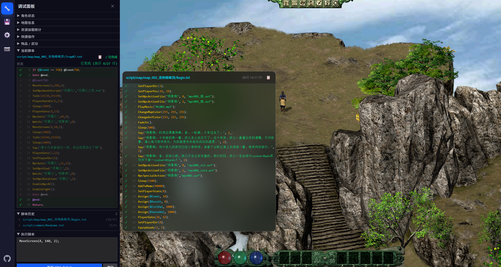
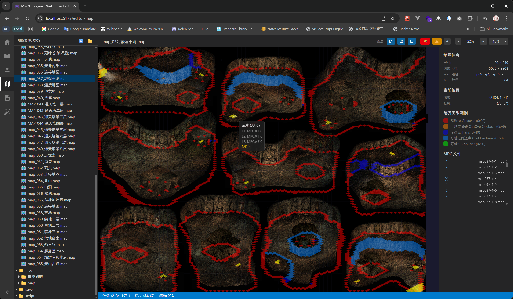
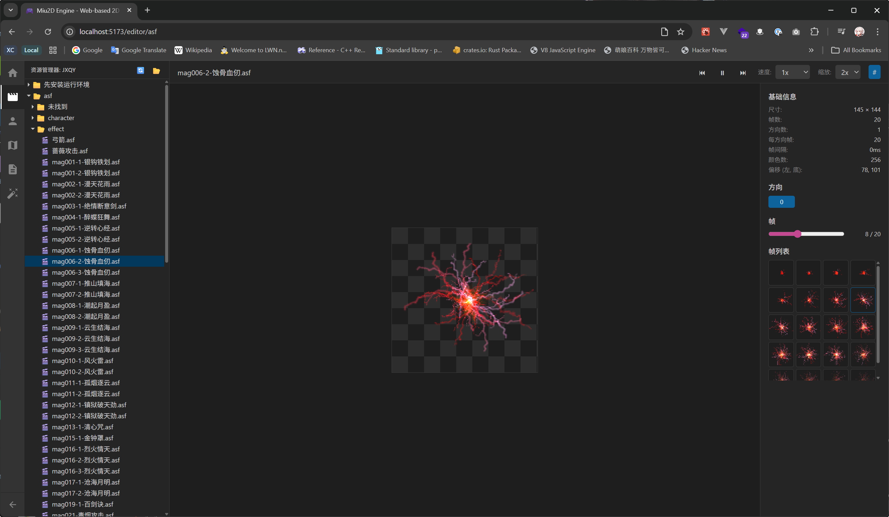

# Miu2D Engine

基于 Web 技术的 2D RPG 游戏引擎。

## 📖 关于本项目

**Miu2D** 是一个使用 **TypeScript + React + WebGL** 技术构建的 2D RPG 游戏引擎，专为 Web 平台设计。

### 🎮 Demo：月影传说 Web 复刻版

🌐 **在线演示**：[https://miu2d.com](https://miu2d.com)

作为引擎的演示项目，我们复刻了**西山居 2001 年**推出的经典单机 RPG《剑侠情缘外传：月影传说》。

原始游戏使用 C++ 开发，后来有玩家用 C# + XNA 框架进行了复刻（[JxqyHD](https://github.com/mapic91/JxqyHD)），本项目在此基础上将游戏移植到 Web 平台，让经典游戏能在浏览器中运行。

> 🎨 **Vibe Coding Project** - 本项目采用纯 vibe coding 方式开发，借助 AI 辅助编程，享受编码的乐趣！

> 📱 **原生移动端支持** - 完美适配手机和平板，虚拟摇杆 + 触控交互，随时随地重温经典武侠！

### 🖥️ 桌面版



### 📱 移动端


### 🛠️ 内置编辑器

**地图编辑器** - 可视化瓦片地图编辑、图层管理、碰撞区域设置



**ASF 编辑器** - 精灵动画帧查看器和调试工具



### 🎮 游戏特色

《剑侠情缘外传：月影传说》是西山居在剑侠情缘系列基础上推出的外传作品，讲述了杨影枫的成长故事：

- 🗺️ **武侠世界探索** - 凌绝峰、武当山、惠安镇等经典场景
- ⚔️ **即时战斗系统** - 剑法、内功、轻功的组合运用
- 🧙 **武学技能** - 丰富的武功招式和内功心法
- 💬 **剧情任务** - 跟随主角杨影枫展开武侠冒险
- 🎒 **装备系统** - 收集装备和道具提升战力
- 🎵 **原版音乐** - 保留经典配乐和音效

---

## ✨ Demo 实现进度

### 总体完成度：约 92%

| 系统 | 进度 | 状态 | 主要模块 |
|------|------|------|----------|
| 地图渲染 | 95% | 🟢 可用 | map.ts, renderer.ts, mapTrapManager.ts |
| 角色系统 | 90% | 🟢 可用 | character.ts, player.ts, npc.ts, npcManager.ts |
| 精灵动画 | 95% | 🟢 可用 | sprite.ts, asf.ts（支持石化/冻结/中毒着色） |
| 剧本系统 | 98% | 🟢 可用 | parser.ts, executor.ts, commands/*（**180+ 命令处理器**） |
| 界面系统 | 95% | 🟢 可用 | guiManager.ts, **29 个 UI 组件**, DebugPanel（10 个模块化区块） |
| 输入系统 | 95% | 🟢 可用 | inputHandler.ts, interactionManager.ts |
| 音效系统 | 95% | 🟢 可用 | audioManager.ts (Web Audio API) |
| 特效系统 | 85% | 🟢 可用 | screenEffects.ts, 淡入淡出/颜色渲染/闪屏/水波纹 |
| 物品系统 | 90% | 🟢 可用 | good.ts, goodsListManager.ts |
| 物体系统 | 85% | 🟢 可用 | obj.ts, objManager.ts, objRenderer.ts |
| 武功系统 | 90% | 🟢 可用 | magicManager.ts, magicSprite.ts, **12 种 MoveKind 特效**, passives/* |
| 战斗系统 | 70% | 🟡 部分 | magicHandler.ts, specialActionHandler.ts |
| 存档系统 | 90% | 🟢 可用 | loader.ts, storage.ts |
| 调试系统 | 95% | 🟢 可用 | debugManager.ts, DebugPanel/（**10 个模块化区块**） |
| 寻路系统 | 90% | 🟢 可用 | pathFinder.ts (A* 算法) |
| 商店系统 | 90% | 🟢 可用 | buyManager.ts, BuyGui.tsx |
| 小地图 | 90% | 🟢 可用 | LittleMapGui.tsx |
| 天气系统 | 85% | 🟢 新增 | weatherManager.ts, rain.ts, snow.ts |
| 计时器系统 | 90% | 🟢 新增 | timerManager.ts, TimerGui.tsx |
| 视频播放 | 80% | 🟢 新增 | VideoPlayer.tsx (HTML5 Video) |
| 伙伴系统 | 85% | 🟢 新增 | partnerList.ts |
| 移动端适配 | 95% | 🟢 新增 | 虚拟摇杆、触控交互、响应式 UI |

**图例**: 🟢 可用 | 🟡 部分/进行中 | 🔴 未开始

### 代码规模
- **引擎代码**: ~47,000 行 TypeScript
- **组件代码**: ~12,000 行 TSX
- **剧本命令**: 180+ 个命令处理器
- **ScriptContext 接口**: 130+ 个方法

---

## 🏗️ 架构设计

### 技术栈

- **语言**: TypeScript 5.9 (strict mode)
- **框架**: React 19, Vite 7
- **渲染**: WebGL 高性能渲染（Canvas 2D 回退）
- **样式**: Tailwind CSS 4
- **音频**: Web Audio API (OGG Vorbis)
- **代码质量**: Biome (lint + format)
- **包管理**: pnpm monorepo

### 项目组成

本项目采用 **pnpm monorepo** 架构，包含两个独立的包：

| 包名 | 目录 | 说明 |
|------|------|------|
| **@miu2d/engine** | `packages/engine/` | 纯 TypeScript 2D RPG 引擎，**不依赖 React**，可独立使用 |
| **@miu2d/web** | `packages/web/` | React 应用，提供 UI 界面、页面路由和用户交互 |

**导入引擎模块：**
```typescript
// 从主入口导入
import { GameEngine, Direction } from "@miu2d/engine";

// 从子模块导入
import { logger } from "@miu2d/engine/core/logger";
import { resourceLoader } from "@miu2d/engine/resource/resourceLoader";
import type { MagicData } from "@miu2d/engine/magic";
```

### 核心架构

本项目采用**分层架构**，严格遵循 C# 版本的设计：

```
┌─────────────────────────────────────────────────────────────┐
│                    React UI Layer                           │
│  ┌─────────────────────────────────────────────────────┐   │
│  │  pages/          GameScreen, TitleScreen, Landing    │   │
│  │  components/game/ Game, GameCanvas, GameUI           │   │
│  │  components/ui/   对话框, 背包, 装备, 武功, 调试面板等  │   │
│  └─────────────────────────────────────────────────────┘   │
└─────────────────────────────┬───────────────────────────────┘
                              │ 事件订阅 / API 调用
                              ▼
┌─────────────────────────────────────────────────────────────┐
│                 GameEngine (单例 - 唯一入口)                  │
│                                                             │
│  ┌─────────────────────────────────────────────────────┐   │
│  │  GlobalResourceManager (全局资源 - 只加载一次)         │   │
│  │  ├── TalkTextList    对话文本数据                     │   │
│  │  ├── LevelManager    等级配置                         │   │
│  │  ├── MagicExpConfig  武功经验配置                     │   │
│  │  └── PartnerList     伙伴名单                         │   │
│  └─────────────────────────────────────────────────────┘   │
│                                                             │
│  ┌─────────────────────────────────────────────────────┐   │
│  │  核心子系统 (由 GameEngine 创建和持有)                  │   │
│  │  ├── AudioManager      音效管理 (Web Audio API)       │   │
│  │  ├── ScreenEffects     屏幕特效 (淡入淡出/颜色/水波)   │   │
│  │  ├── WeatherManager    天气系统 (雨/雪/闪电)          │   │
│  │  ├── TimerManager      计时器管理 (限时任务)          │   │
│  │  ├── ObjManager        物体管理                       │   │
│  │  ├── DebugManager      调试系统                       │   │
│  │  ├── MemoListManager   任务记录                       │   │
│  │  ├── MapTrapManager    地图陷阱                       │   │
│  │  ├── MapRenderer       地图渲染                       │   │
│  │  └── ObjRenderer       物体渲染                       │   │
│  └─────────────────────────────────────────────────────┘   │
│                                                             │
│  ┌─────────────────────────────────────────────────────┐   │
│  │  GameManager (游戏逻辑控制器)                          │   │
│  │  ├── Player            玩家角色                       │   │
│  │  ├── NpcManager        NPC 管理                       │   │
│  │  ├── GuiManager        界面状态管理                   │   │
│  │  ├── ScriptExecutor    剧本执行器 (180+ 命令)         │   │
│  │  ├── GoodsListManager  物品列表                       │   │
│  │  ├── MagicListManager  武功列表                       │   │
│  │  ├── MagicManager      武功逻辑和渲染 (12 种特效)     │   │
│  │  ├── InputHandler      输入处理                       │   │
│  │  └── InteractionManager 交互管理                      │   │
│  └─────────────────────────────────────────────────────┘   │
│                                                             │
│  EventEmitter (事件系统 - 引擎与UI通信)                      │
└─────────────────────────────────────────────────────────────┘
```

### 初始化流程

参照 C# 的 `JxqyGame.cs` 和 `Loader.cs`，分为三个阶段：

```typescript
// 1. 引擎初始化 (只执行一次)
await engine.initialize();
// - 加载全局资源 (TalkTextList, LevelManager, MagicExp等)
// - 创建渲染器和游戏管理器

// 2. 新游戏
await engine.newGame();
// - 运行 NewGame.txt 脚本
// - 脚本调用 LoadGame(0) 加载初始存档

// 3. 读取存档
await engine.loadGame(saveIndex);
// - 清理当前状态
// - 从存档目录加载数据
```

### 设计原则

- **单一入口**：所有子系统访问都通过 `GameEngine`，不使用全局单例函数
- **依赖注入**：子系统通过构造函数或 setter 接收依赖
- **事件驱动**：引擎通过 `EventEmitter` 通知 UI 层状态变化
- **分离关注**：引擎逻辑与 React 渲染完全分离

---

## 📁 项目结构

```
game-jxqy/
├── packages/
│   ├── engine/                  # @miu2d/engine - 游戏引擎（~47k 行）
│   │   ├── src/
│   │   │   ├── index.ts         # 主导出文件
│   │   │   │
│   │   │   ├── core/            # 核心模块
│   │   │   │   ├── types.ts     # 核心类型定义
│   │   │   │   ├── mapTypes.ts  # 地图相关类型
│   │   │   │   ├── pathFinder.ts # A* 寻路算法
│   │   │   │   ├── eventEmitter.ts # 事件系统
│   │   │   │   ├── gameEvents.ts # 游戏事件定义
│   │   │   │   └── logger.ts    # 日志系统
│   │   │   │
│   │   │   ├── game/            # 游戏管理
│   │   │   │   ├── gameEngine.ts # 引擎单例（入口）
│   │   │   │   ├── gameManager.ts # 游戏逻辑控制器
│   │   │   │   ├── inputHandler.ts # 输入处理
│   │   │   │   ├── loader.ts    # 存档加载器
│   │   │   │   └── storage.ts   # 存档存储
│   │   │   │
│   │   │   ├── resource/        # 资源管理
│   │   │   ├── map/             # 地图系统
│   │   │   ├── sprite/          # 精灵系统
│   │   │   ├── character/       # 角色系统
│   │   │   ├── player/          # 玩家系统
│   │   │   ├── npc/             # NPC 系统
│   │   │   ├── obj/             # 物体系统
│   │   │   ├── script/          # 剧本系统（180+ 命令）
│   │   │   ├── magic/           # 武功系统（12 种特效）
│   │   │   ├── gui/             # 界面状态管理
│   │   │   ├── audio/           # 音效系统
│   │   │   ├── effects/         # 屏幕特效
│   │   │   ├── weather/         # 天气系统
│   │   │   ├── timer/           # 计时器系统
│   │   │   ├── config/          # 配置管理
│   │   │   ├── constants/       # 常量定义
│   │   │   └── utils/           # 工具模块
│   │   │
│   │   ├── package.json
│   │   └── tsconfig.json
│   │
│   └── web/                     # @miu2d/web - React 应用（~12k 行）
│       ├── src/
│       │   ├── components/      # React 组件
│       │   │   ├── game/        # 游戏核心组件
│       │   │   │   ├── Game.tsx
│       │   │   │   ├── GameCanvas.tsx
│       │   │   │   └── GameUI.tsx
│       │   │   │
│       │   │   └── game/ui/     # UI 组件（29 个）
│       │   │       ├── classic/ # 经典 ASF 风格
│       │   │       └── modern/  # 现代风格
│       │   │
│       │   ├── pages/           # 页面组件
│       │   ├── hooks/           # React Hooks
│       │   ├── styles/          # 样式文件
│       │   ├── App.tsx
│       │   └── main.tsx
│       │
│       ├── public/              # 静态资源
│       ├── resources -> ../../resources  # 游戏资源（符号链接）
│       ├── index.html
│       ├── package.json
│       ├── tsconfig.json
│       └── vite.config.ts
│
├── resources/                   # 游戏资源
│   ├── map/                     # 地图文件 (.map)
│   ├── asf/                     # 精灵动画 (.asf)
│   ├── mpc/                     # 资源包 (.mpc)
│   ├── ini/                     # 配置文件 (.ini)
│   ├── script/                  # 游戏剧本 (.txt)
│   ├── save/                    # 存档目录
│   └── Content/                 # 媒体资源
│       ├── music/               # 背景音乐 (.ogg)
│       ├── sound/               # 音效文件 (.ogg)
│       └── video/               # 视频文件
│
├── scripts/                     # 工具脚本
├── docs/                        # 文档
├── JxqyHD/                      # C# 参考代码
│
├── pnpm-workspace.yaml          # pnpm 工作区配置
├── package.json                 # 根 package.json
└── biome.json                   # 代码风格配置
```
│   │   │   ├── inputHandler.ts  # 输入处理
│   │   │   ├── interactionManager.ts  # 交互管理
│   │   │   ├── magicHandler.ts  # 武功处理
│   │   │   ├── specialActionHandler.ts  # 特殊动作
│   │   │   ├── cameraController.ts    # 镜头控制
│   │   │   ├── collisionChecker.ts    # 碰撞检测
│   │   │   ├── mapTrapManager.ts      # 地图陷阱
│   │   │   ├── loader.ts        # 存档加载器
│   │   │   ├── storage.ts       # 存档存储
│   │   │   └── scriptContextFactory.ts  # 脚本上下文（130+ 方法）
│   │   │
│   │   ├── resource/            # 资源管理
│   │   │   ├── globalResourceManager.ts  # 全局资源
│   │   │   ├── resourceLoader.ts # 统一资源加载器（缓存+去重）
│   │   │   ├── mpc.ts           # MPC 资源包解析
│   │   │   └── resFile.ts       # 资源文件解析
│   │   │
│   │   ├── map/                 # 地图系统
│   │   │   ├── map.ts           # 地图解析
│   │   │   ├── renderer.ts      # 地图渲染
│   │   │   └── mapTrapManager.ts # 陷阱管理
│   │   │
│   │   ├── sprite/              # 精灵系统
│   │   │   ├── sprite.ts        # 精灵类（状态着色）
│   │   │   └── asf.ts           # ASF 动画加载
│   │   │
│   │   ├── character/           # 角色系统
│   │   │   ├── character.ts     # 角色基类
│   │   │   ├── npc.ts           # NPC
│   │   │   ├── npcManager.ts    # NPC 管理
│   │   │   ├── iniParser.ts     # INI 配置解析
│   │   │   ├── resFile.ts       # 资源文件解析
│   │   │   └── level/           # 等级系统
│   │   │
│   │   ├── player/              # 玩家系统
│   │   │   ├── player.ts        # 玩家角色
│   │   │   ├── goods/           # 物品系统
│   │   │   │   ├── good.ts
│   │   │   │   └── goodsListManager.ts
│   │   │   └── magic/           # 玩家武功
│   │   │       └── magicListManager.ts
│   │   │
│   │   ├── script/              # 剧本系统（3000+ 行）
│   │   │   ├── parser.ts        # 解析器
│   │   │   ├── executor.ts      # 执行器
│   │   │   └── commands/        # 命令处理器（180+ 命令）
│   │   │       ├── types.ts      # ScriptContext 接口（130+ 方法）
│   │   │       ├── dialogCommands.ts    # 对话命令
│   │   │       ├── npcCommands.ts       # NPC 命令
│   │   │       ├── playerCommands.ts    # 玩家命令
│   │   │       ├── gameStateCommands.ts # 游戏状态命令
│   │   │       └── miscCommands.ts      # 杂项命令（商品/镜头/存档/变量/特效）
│   │   │
│   │   ├── magic/               # 武功系统
│   │   │   ├── magicManager.ts  # 武功逻辑管理
│   │   │   ├── magicSprite.ts   # 武功精灵
│   │   │   ├── magicRenderer.ts # 武功渲染
│   │   │   ├── magicLoader.ts   # 武功配置加载
│   │   │   ├── magicUtils.ts    # 工具函数
│   │   │   ├── types.ts         # 类型定义（MoveKind/SpecialKind）
│   │   │   ├── effects/         # 武功特效（12 种 MoveKind）
│   │   │   │   ├── normalAttack.ts    # 普通飞行攻击
│   │   │   │   ├── throw.ts           # 投掷
│   │   │   │   ├── followCharacter.ts # 跟随角色（BUFF）
│   │   │   │   ├── followEnemy.ts     # 追踪敌人
│   │   │   │   ├── fixedPosition.ts   # 固定位置
│   │   │   │   ├── regionBased.ts     # 区域攻击
│   │   │   │   ├── superMode.ts       # 全屏攻击
│   │   │   │   ├── specialMoveKinds.ts # 特殊类型（传送/召唤/控制）
│   │   │   │   └── registry.ts        # 特效注册表
│   │   │   └── passives/        # 被动效果
│   │   │       ├── passiveManager.ts
│   │   │       └── xiuLianEffect.ts   # 修炼效果
│   │   │
│   │   ├── obj/                 # 物体系统
│   │   │   ├── obj.ts
│   │   │   ├── objManager.ts
│   │   │   └── objRenderer.ts
│   │   │
│   │   ├── gui/                 # 界面状态管理
│   │   │   ├── guiManager.ts
│   │   │   ├── buyManager.ts    # 商店管理器
│   │   │   ├── fonts.ts
│   │   │   ├── uiSettings.ts
│   │   │   └── uiConfig.ts      # UI 配置
│   │   │
│   │   ├── audio/               # 音效系统
│   │   │   └── audioManager.ts  # Web Audio API 实现
│   │   │
│   │   ├── effects/             # 屏幕特效系统
│   │   │   └── screenEffects.ts # 淡入淡出/颜色渲染/闪屏/水波纹
│   │   │
│   │   ├── weather/             # 天气系统
│   │   │   ├── weatherManager.ts # 天气管理器
│   │   │   ├── rain.ts          # 雨（含闪电）
│   │   │   ├── raindrop.ts
│   │   │   ├── snow.ts          # 雪
│   │   │   └── snowflake.ts
│   │   │
│   │   ├── timer/               # 计时器系统
│   │   │   └── timerManager.ts  # 限时任务
│   │   │
│   │   ├── listManager/         # 列表管理
│   │   │   ├── memoListManager.ts   # 任务记录
│   │   │   ├── talkTextList.ts      # 对话文本
│   │   │   └── partnerList.ts       # 伙伴名单
│   │   │
│   │   ├── utils/               # 工具模块
│   │   │
│   │   └── debug/               # 调试系统
│   │       └── debugManager.ts
│   │
│   ├── components/              # React 组件（~12k 行）
│   │   ├── game/                # 游戏核心组件
│   │   │   ├── Game.tsx         # 游戏主组件（Canvas + UI）
│   │   │   ├── GameCanvas.tsx   # Canvas 渲染
│   │   │   ├── GameUI.tsx       # 游戏内 UI 层
│   │   │   ├── LoadingOverlay.tsx
│   │   │   └── MapViewer.tsx    # 地图查看器（开发工具）
│   │   │
│   │   └── game/ui/             # UI 组件（29 个）
│   │       ├── DialogUI.tsx     # 对话框
│   │       ├── SelectionUI.tsx  # 选项菜单
│   │       ├── SelectionMultipleUI.tsx # 多选菜单
│   │       ├── GoodsGui.tsx     # 物品栏
│   │       ├── EquipGui.tsx     # 装备界面
│   │       ├── NpcEquipGui.tsx  # NPC 装备
│   │       ├── MagicGui.tsx     # 武功界面
│   │       ├── StateGui.tsx     # 状态界面
│   │       ├── MemoGui.tsx      # 任务记录
│   │       ├── XiuLianGui.tsx   # 修炼界面
│   │       ├── BuyGui.tsx       # 商店界面
│   │       ├── LittleMapGui.tsx # 小地图
│   │       ├── SystemGui.tsx    # 系统菜单
│   │       ├── SaveLoadGui.tsx  # 存读档界面
│   │       ├── TopGui.tsx       # 顶部状态栏
│   │       ├── BottomGui.tsx    # 底部快捷栏
│   │       ├── BottomStateGui.tsx # 底部状态
│   │       ├── SidePanel.tsx    # 侧边面板
│   │       ├── MessageGui.tsx   # 消息提示
│   │       ├── NpcLifeBar.tsx   # NPC 血条
│   │       ├── GameCursor.tsx   # 游戏光标
│   │       ├── ItemTooltip.tsx  # 物品提示
│   │       ├── MagicTooltip.tsx # 武功提示
│   │       ├── TimerGui.tsx     # 计时器显示
│   │       ├── VideoPlayer.tsx  # 视频播放器
│   │       ├── TitleGui.tsx     # 标题界面
│   │       ├── TitleSettingsModal.tsx # 设置弹窗
│   │       ├── AsfAnimatedSprite.tsx # ASF 动画组件
│   │       ├── ScrollBar.tsx    # 滚动条
│   │       └── DebugPanel/      # 调试面板（模块化，10 个区块）
│   │           ├── DebugPanel.tsx
│   │           ├── sections/    # 各区块组件
│   │           │   ├── CharacterSection.tsx
│   │           │   ├── MapSection.tsx
│   │           │   ├── ScriptSection.tsx
│   │           │   ├── ScriptHistorySection.tsx
│   │           │   ├── ScriptExecuteSection.tsx
│   │           │   ├── VariablesSection.tsx
│   │           │   ├── ItemMagicSection.tsx
│   │           │   ├── ResourceSection.tsx
│   │           │   ├── XiuLianSection.tsx
│   │           │   └── QuickActionsSection.tsx
│   │           └── ...
│   │
│   ├── pages/                   # 页面组件
│   │   ├── GameScreen.tsx       # 游戏主页面
│   │   ├── TitleScreen.tsx      # 标题页面
│   │   ├── MapViewerScreen.tsx  # 地图查看器
│   │   ├── NotFoundPage.tsx     # 404 页面
│   │   └── landing/             # 落地页（13 个组件）
│   │       ├── LandingPage.tsx
│   │       ├── Hero.tsx
│   │       ├── Features.tsx
│   │       ├── TechStack.tsx
│   │       └── ...
│   │
│   ├── hooks/                   # React Hooks
│   │   └── useGameEngine.ts
│   │
│   ├── styles/                  # 样式文件
│   │   └── index.css
│   │
│   ├── constants/               # 常量定义
│   │
│   ├── App.tsx                  # 应用入口（页面路由）
│   └── main.tsx                 # 主入口
│
├── resources/                   # 游戏资源
│   ├── map/                     # 地图文件 (.map)
│   ├── asf/                     # 精灵动画 (.asf)
│   ├── mpc/                     # 资源包 (.mpc)
│   ├── ini/                     # 配置文件 (.ini)
│   ├── script/                  # 游戏剧本 (.txt)
│   ├── save/                    # 存档目录
│   └── Content/                 # 媒体资源
│       ├── music/               # 背景音乐 (.ogg)
│       ├── sound/               # 音效文件 (.ogg)
│       └── video/               # 视频文件
│
├── scripts/                     # 工具脚本
│   ├── convert-encoding.sh      # 文本编码转换 (GBK → UTF-8)
│   └── convert-sound.py         # 音效转换 (XNB → OGG)
│
├── docs/                        # 文档和截图
│
└── JxqyHD/                      # C# 参考代码
    └── Engine/                  # 引擎源码参考
```

---

## 🚀 快速开始

### 环境要求

- **Node.js** 18+
- **pnpm** 9+（必须）
- 支持 WebGL 和 Web Audio API 的现代浏览器

### 安装运行

```bash
# 克隆仓库
git clone https://github.com/patchoulib/game-jxqy.git
cd game-jxqy

# 安装依赖（pnpm monorepo）
pnpm install

# 启动开发服务器
pnpm dev

# 打开浏览器访问 http://localhost:5173
```

### 构建生产版本

```bash
pnpm build
pnpm preview
```

### 常用命令

```bash
pnpm dev        # 启动开发服务器
pnpm build      # 构建生产版本
pnpm tsc        # TypeScript 类型检查
pnpm lint       # 代码检查
pnpm format     # 代码格式化
```

---

## 🎮 操作指南

### 键盘控制

| 按键 | 功能 |
|------|------|
| `方向键` / 点击地面 | 移动 |
| `Shift` + 移动 | 奔跑 |
| `Space` / `Enter` | 与 NPC 交互 / 确认对话 |
| `Esc` | 取消 / 关闭菜单 / 系统菜单 |
| `1` - `9` | 使用快捷栏武功 |

### 鼠标控制

| 操作 | 功能 |
|------|------|
| 左键点击地面 | 移动到位置 |
| 左键点击 NPC/物体 | 交互 |
| 右键点击 NPC/物体 | 使用备用脚本 |

### 📱 移动端触控

| 操作 | 功能 |
|------|------|
| 虚拟摇杆（左下角） | 控制角色移动方向 |
| 轻触屏幕 | 与 NPC/物体交互 |
| 底部快捷栏 | 使用武功技能 |
| 右侧功能按钮 | 打开背包/武功/装备等界面 |

---

## 💻 开发指南

### 项目命令

```bash
pnpm dev          # 启动开发服务器
pnpm build        # 构建生产版本
pnpm preview      # 预览生产版本
pnpm tsc          # TypeScript 类型检查
pnpm lint         # 代码检查
```

### 开发原则

1. **严格遵循 C# 架构** - 所有新功能必须先查看 `/JxqyHD/Engine/` 中的对应实现
2. **通过引擎访问** - 所有子系统访问都通过 `GameEngine`，不创建独立的全局单例
3. **保持类型安全** - 使用 TypeScript strict mode，避免 `any`
4. **事件驱动通信** - 引擎与 UI 通过事件通信，保持解耦

### 资源文件格式

| 格式 | 说明 | 编码 | 位置 |
|------|------|------|------|
| `.map` | 地图数据（瓦片、碰撞） | 二进制 | `/resources/map/` |
| `.asf` | 精灵动画帧 | 二进制 | `/resources/asf/` |
| `.mpc` | 压缩资源包 | 二进制 | `/resources/mpc/` |
| `.obj` | 物体存档文件 | GBK | `/resources/ini/save/` |
| `.npc` | NPC 存档文件 | UTF-8 | `/resources/ini/save/` |
| `.ini` | 配置文件（NPC、物品等） | UTF-8 | `/resources/ini/` |
| `.txt` | 游戏剧本 | UTF-8 | `/resources/script/` |
| `.ogg` | 音频文件（音乐和音效） | 二进制 | `/resources/Content/` |

### 资源加载架构

所有资源加载都通过 `resourceLoader` 统一管理：

```typescript
import { resourceLoader } from "../resource/resourceLoader";

// 文本资源（UTF-8）
const content = await resourceLoader.loadText("/resources/script/xxx.txt");

// 二进制资源（.map, .asf, .mpc, 音频）
const buffer = await resourceLoader.loadBinary("/resources/map/xxx.map");

// 获取加载统计（在调试面板显示）
const stats = resourceLoader.getStats();
```

**特性：**
- **缓存**：每个资源只加载一次，后续请求直接返回缓存
- **去重**：并发请求同一资源时，只发起一次网络请求
- **统计**：跟踪请求次数、命中率、失败次数（调试面板可见）

### 工具脚本

```bash
# 转换文本编码 (GBK → UTF-8)
./scripts/convert-encoding.sh

# 转换音效文件 (XNB → OGG，小写文件名)
python3 scripts/convert-sound.py
```

详细开发指南请参阅 [.github/copilot-instructions.md](.github/copilot-instructions.md)

---

## 🗺️ 开发路线

### 第一阶段：核心基础 ✅
- [x] 地图渲染系统
- [x] 角色移动和动画
- [x] 剧本系统（180+ 命令）
- [x] 基础界面（29 个 UI 组件）
- [x] 操作控制
- [x] 音效系统（Web Audio API + OGG）
- [x] 架构重构（GameEngine 单例入口）

### 第二阶段：游戏机制 ✅
- [x] 武功技能（12 种 MoveKind 特效）
- [x] 战斗系统（基础完成）
- [x] 背包物品
- [x] 装备系统
- [x] 存档/读档
- [x] 商店交易（BuyManager + BuyGui）
- [x] 小地图（LittleMapGui）
- [x] 天气系统（雨/雪/闪电）
- [x] 计时器系统（限时任务）
- [x] 视频播放（HTML5 Video）
- [x] 伙伴系统（PartnerList）

### 第三阶段：完善功能（进行中）
- [x] 高级寻路 (A*)
- [x] 状态效果渲染（石化/冻结/中毒着色）
- [x] 屏幕特效（淡入淡出/颜色渲染/水波纹）
- [ ] NPC AI 优化
- [ ] 任务系统完善

### 第四阶段：优化与扩展
- [ ] 性能优化
- [x] 移动端支持（虚拟摇杆 + 触控交互 + 响应式 UI）
- [ ] 手柄支持
- [ ] 设置菜单完善

---

## 🤝 参与贡献

欢迎提交 Bug 修复、新功能或文档改进！

### 贡献步骤

1. Fork 本仓库
2. 创建功能分支 (`git checkout -b feature/new-feature`)
3. 参考 [开发指南](.github/copilot-instructions.md)
4. 提交更改 (`git commit -m '添加新功能'`)
5. 推送到分支 (`git push origin feature/new-feature`)
6. 提交 Pull Request

---

## 📄 许可证

本项目采用 MIT 许可证 - 详见 [LICENSE](LICENSE) 文件。

**注意**：这是一个学习性质的粉丝项目，游戏素材和知识产权归原作者所有。

---

## 🙏 致谢

- **原作游戏**：西山居 (Kingsoft) - 剑侠情缘外传：月影传说 (2001)
- **C# 复刻项目**：[mapic91/JxqyHD](https://github.com/mapic91/JxqyHD)
- **技术栈**：TypeScript, React 19, Vite 7, WebGL, Web Audio API

---

<div align="center">

**⚔️ 剑气纵横三万里，一剑光寒十九洲 ⚔️**

*用现代 Web 技术重现经典武侠*

</div>
